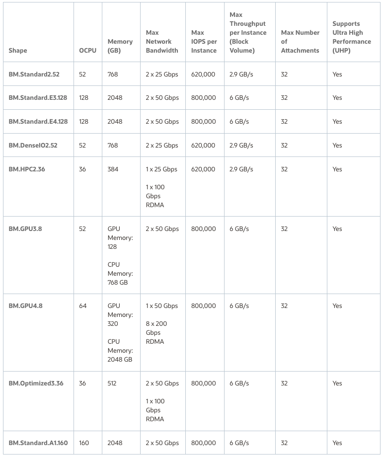
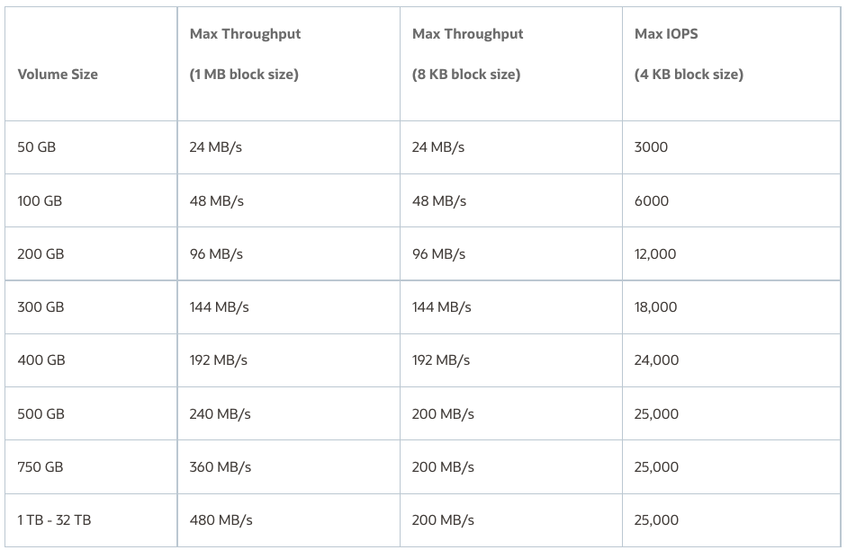
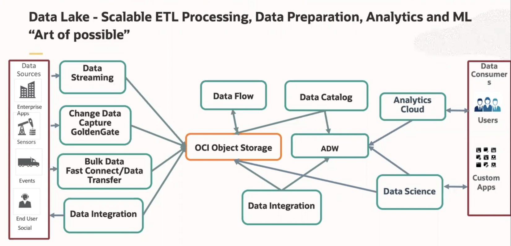
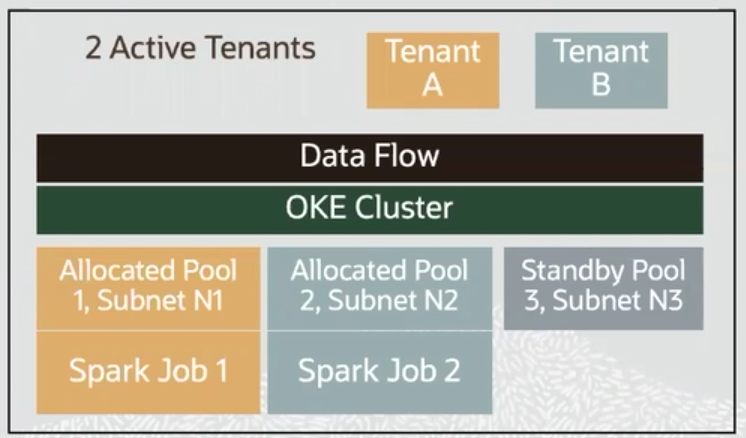
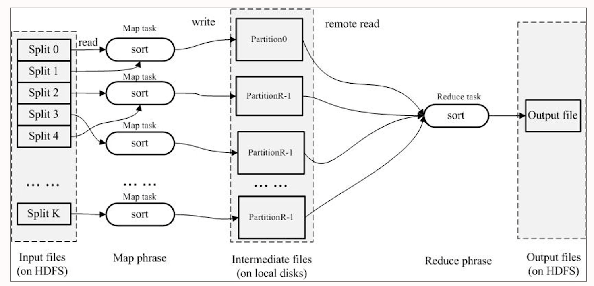
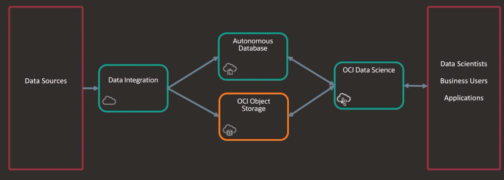
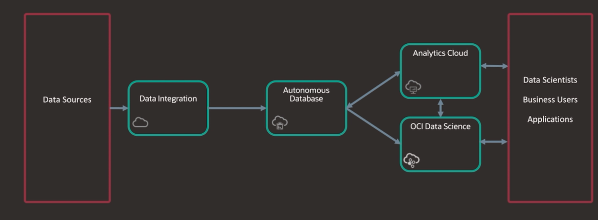

Oracle Cloud Infrastructure 2021 HPC and Big Data Solutions
=========================================

Purpose
-------------
Preparation guide for OCI 2021 HPC and Big Data Solutions Associate 


- [OCI 2021 HPC and Big Data Solutions Associate](#oci-2021-hpc-and-big-data-solutions-associate)
  * [Overview of Infrastructure Resources](#overview-of-infrastructure-resources)
    + [Memory](#memory)
    + [Network](#network)
    + [CPU](#cpu)
      - [What is a GPU](#what-is-a-gpu)
    + [Storage](#storage)
      - [Bare Metal Shapes in OCI](#bare-metal-shapes-in-oci)
      - [Key Takeaways:](#key-takeaways-)
      - [Block Volume Elastic Performance Tiers](#block-volume-elastic-performance-tiers)
      - [Block Volumes Performance Tiers v2](#block-volumes-performance-tiers-v2)
      - [Block Volume Performance Levels](#block-volume-performance-levels)
    + [Storage Tier Performance Overview](#storage-tier-performance-overview)
      - [Block Storage](#block-storage)
        * [Block Storage IO](#block-storage-io)
        * [Block Storage Performance](#block-storage-performance)
      - [Object Storage](#object-storage)
  * [HPC](#hpc)
        * [Deployment Models](#deployment-models)
        * [Embarrassingly Parallel Workloads](#embarrassingly-parallel-workloads)
        * [Tightly Coupled Workloads](#tightly-coupled-workloads)
        * [Use Cases of Data Heavy/Tightly Coupled Workloads](#use-cases-of-data-heavy-tightly-coupled-workloads)
    + [HPC File Systems](#hpc-file-systems)
      - [Feature Summary](#feature-summary)
      - [File System IO Throughput](#file-system-io-throughput)
      - [Shape Types](#shape-types)
        * [Frequecy](#frequecy)
    + [Data Lake - ETL Processing](#data-lake---etl-processing)
    + [MPI: Message Passing Interface](#mpi--message-passing-interface)
  * [Big Data Services in OCI](#big-data-services-in-oci)
    + [Big Data Service (Was Big Data Cloud Service-Deprecated)](#big-data-service--was-big-data-cloud-service-deprecated-)
      - [Value Proposition](#value-proposition)
    + [Oracle Data Science](#oracle-data-science)
        * [Key Points](#key-points)
    + [Oracle Data Flow - Spark Based](#oracle-data-flow---spark-based)
        * [Key Points](#key-points-1)
      - [Data Flow Execution Model](#data-flow-execution-model)
    + [Oracle Streaming Service](#oracle-streaming-service)
    + [OCI Data Integration - Drop and Drag](#oci-data-integration---drop-and-drag)
        * [Key Features](#key-features)
    + [OCI Data Catalog](#oci-data-catalog)
        * [Key Features](#key-features-1)
    + [OCI IaaS](#oci-iaas)
    + [HDFS Storage Options](#hdfs-storage-options)
      - [Deployment Models](#deployment-models-1)
    + [Terasoft](#terasoft)
      - [TeraSort Detail](#terasort-detail)
  * [Example Architectures](#example-architectures)
  * [Customer Scenario](#customer-scenario)
        * [Key Considerations](#key-considerations)
        * [Customer Response](#customer-response)
      - [OCI Solution Design](#oci-solution-design)
        * [Compute Configuration](#compute-configuration)
        * [Storage Configuration](#storage-configuration)
    + [Alternative Architecture](#alternative-architecture)
  * [Sample Exam Questions](#sample-exam-questions)
        * [Monte Carlo simulation](#monte-carlo-simulation)

## OCI 2021 HPC and Big Data Solutions Associate

### Overview of Infrastructure Resources

#### Memory
**Memory bandwidth :** Referes to how fast the memory can be accessed by the CPU.
- **Example:** BareMetal has 384GB of memory for 36 core, which is roughly 10 GB a core.

#### Network 
**Throughput :** How much data can transit from one node per second.
**Latency :** How long it takes to get an answer from a request.

**RDMA Network :** Low latency (~1.7 microseconds) network with 100Gbps throughput.

**CPU core :** Relatively heavy-weight, designed for complex control logic, optimized for sequential programs.

**GPU core :** Relatively light-weight, designed with simple control logic, optimized for data-parallel tasks, focusing on throughput of parallel programs.

**CPU+GPU :** Heterogeneous architecture.

#### CPU

##### What is a GPU
- **GPU :** Graphics Processing Unit.
- **GPGPU :** General Purpose GPU.
- **GPU-Accelerated Computing :** It is the use of a GPU together with a CPU to accelerate scientific, analytics, engineering, consumer, and enterprise application.
- **CUDA :** Compute Unified Device Architecture.
- **Remark :** GPU does not work by itself. It is used as a device of a CPU.

#### Storage

##### Bare Metal Shapes in OCI

All Current Bare Metal Shapes support the Ultra High Performance Level



- A **Block** is simply a unit of data that is read/written during an I/O operation.
- The Block unit size could be 1 byte, 4 byte or 1 Mbyte. All IO operation will fetch this size of data. The default Block size on volumes is 4K.
- **IOPS** measures the number of read and write operations per second.
- **Throughput** measures the number of bytes read or written per second.
    - ***Throughput (MB/s)*** = ***IOPS * Block Size****

##### Key Takeaways:
- Throughput and Block Size have a direct relationship to each other. It means, large Block size will yield higher throughput.
- As block size increases, it takes longer latency to read a single block, thus the # of IOPS decreases. Inversely, smaller block sizes yield higher IOPS. Like random IO work.
- For **High Throughput workloads like large file Sequential IO**, a larger block size is recommended (256K or higher, 1M, 2M, 8M, etc.)
- For **Random IO workloads** like database and small files, which require high IOPS (low latency), a small block size is recommended.

##### Block Volume Elastic Performance Tiers

|Performance Level|IOPS/GB|Max IOPS/Volume|Throughput/GB|Max Throughput/Volume|VPUs/GB|
|-----------------|-------|---------------|-------------|---------------------|-------|
|**Lower Cost**   |2|3000|240|Up to 480|0|
|**Balanced**     |60|25.000|480|480|10|
|**Higher Performance**|75|35.000|600|480|20|

##### Block Volumes Performance Tiers v2

**Question :** If you need 3TB of data, which block size gives you the highest throughput for that size of data?

If that's the requirement then we need to focus on **480** as can look through in the table below and the volume size should be between **800 GB and 32 TB with 3 volumes** and, basically gives you the highest performance

When you're looking for the highest throughput, you need to think about block size.
Larger files need larger block sizes.

Do you want a lower-cost option or do you want the higher-cost option?


```bash
*  1 MB block size best for writing larger files. (OLAP based)
** 1 KB block size best for writing many small files. (OLTP based)
```

##### Block Volume Performance Levels

**VPUs :** Volume Performance Units
- **Ultra High Performance :**
    - Recommended for workloads with the highest I/O requirements,
    - You can purchase between 30 – 120 VPUs per GB/month
- **Higher Performance :**
    - Recommended for workloads with high I/O requirements that don't require the performance of the Ultra High Performance level.
    - You can purchase between 20 VPUs per GB/month
- **Balanced:**
    - The default performance level for new and existing block and boot volumes, and provides a good balance between performance and cost savings for most workloads.
    - You can purchase between 10 VPUs per GB/month
- **Lower Cost :**
    - Recommended for throughput intensive workloads with large sequential I/O, such as streaming, log processing, and data warehouses.
    - The cost is only the storage cost, there is no additional VPU cost. 
    - This option is only available for block volumes, it is not available for boot volumes.

Block Volume performance SLA for IOPS per volume and IOPS per instance applies to the Balanced, Higher Performance, and Ultra High Performance levels only, not the Lower Cost level.

#### Storage Tier Performance Overview

##### Block Storage

###### Block Storage IO

Because block storage uses the primary VNIC of the instance along with the available network bandwidth on that instance to drive storage I/O we need to take into consideration for planning how many volumes we need per instance to achieve the **26Tb target**. In this case, the customer chose a Bare Metal shape, which supports two physical interfaces, so we can segregate the storage traffic onto one network on the primary interface, allowing us to consume up to **25Gbps** at peak throughput.

###### Block Storage Performance

**OCI block storage performance** is calculated at IOPS and MB/s per GB volume size. There are also different performance tiers for block storage which scale IOPS and MB/s at different rates, for different costs. Regardless, the throughput peaks at **480MB/s per volume**. Using **25Gbps** as a max peak rate, we can calculate a total of **9 Block Volumes at 480MB/s** could consume the entire primary interface bandwidth at peak, after which we would get diminishing returns for additioanl volumes. If we divide the **26Tb per instance by 9**, we get a size of **2.88Tb** per volume, which regardless of disk performance tier will achieve max throughput at that size.

##### Object Storage

OCI also supports remote HDFS on Object Storage using two methods:
- OCI HDFS Connector
- S3 Compatibility

Some closed-source distributions of Hadoop do not support the OCI HDFS Connector, in which case S3 Compatibility is the only option for copying local HDFS data into the Object Storage (and vice versa).

### HPC

High Performance Computing most generally refers to the practice of aggregating computing power in a way that delivers much higher performance that once could get out of a typical desktop computer or workstation in order to solve large problems in science, engineering, or business.

**HPC on OCI is Offered as an Infrastructure as a Service with:**
- Bare Metal CPU and GPU instances
- Fast cluster networking
- Ultralow-latency NVMe flash storage
- Block volumes and parallel file systems
- Has 36 cores, 384 Gb of RAM and 6TB of NVMe local storage

###### Deployment Models
- Command Line and APIs for integration to automated workflows
- Stacks, use Resource Manager Stacks for interface based Terraform Deployment
- Marketplace

HPC can be run on many kinds of workloads, but the two most common are embarrassingly parallel workloads and tightly coupled workloads.

###### Embarrassingly Parallel Workloads

Are computational problems divided into small, simple, and independent tasks that can be run at the same time, often with little or no communication between them. 

For example, a company might submit 100 million credit card records to individual processor cores in a cluster of nodes. Processing one credit card record is a small task, and when 100 million records are spread across the cluster, those small tasks can be performed at the same time (in parallel) at astonishing speeds. Common use cases include risk simulations, molecular modeling, contextual search, and logistics simulations.

###### Tightly Coupled Workloads

Typically take a large shared workload and break it into smaller tasks that communicate continuously. In other words, the different nodes in the cluster communicate with one another as they perform their processing. 

Common use cases include computational fluid dynamics, weather forecast modeling, material simulations, automobile collision emulations, geospatial simulations, and traffic management.

**Recommendation :** 
- Cluster Networking
- Use BM.HPC2.36

###### Use Cases of Data Heavy/Tightly Coupled Workloads
- Seismic Processing
- Metagenomics

#### HPC File Systems
##### Feature Summary
- Great for high performance workloads which require high throughput or high IOPS/Low latency
- Performance scales linearly as file cluster grows.
- Less than $0.05 GB/month infrastructure costs (Compute + Storage)
- A high availability filesystem on OCI with POSIX semantics
- Dynamic storage capacity independent of storage throughput.
- Storage tiering using different performance tiers (higher, balanced & lower cost) of Block Volume Service
- Automatically deploy in minutes using Terraform, Resource Manager or Marketplace, no additional configuration required.
- Protocol access via Native filesystem, NFS, SMB, etc.

##### File System IO Throughput

The following table lists the Block Volume service's throughput and IOPS performance numbers based on volume size for this option. IOPS and KB/s performance scales linearly per GB volume size up to the service maximums so you can predictably calculate the performance numbers for a specific volume size. If you're trying to achieve certain performance targets for volumes configured to use the Balanced performance level you can provision a minimum volume size using this table as a reference.



A Higher Performance Block Volume of size 800 GB or **Higher delivers 480 MB/s for 1MB Block Size.** Multiple Volumes can be attached to file server.

**NIC :** Network interface controller

```
* 8 Gbps = 1 GB/s 

1 NICs of 25 Gbps = 3.125 GB/s = 3125 MB/s
```

To get Maximum throughput from the file server, the total Storage IO throughput should be more than Network bandwidth (NIC-3125 MB/s) connecting Storage to file server.

**Example :**
```
3125/480 = 6.5 Volumes (rounded:7)
```
*This means even you have 8 or more Volumes, Max Throughput for 1 MB block size, does not change. Network layer will be the bottleneck.*

**Oracle Recommendation :** 8 Volumes

##### Shape Types

###### Frequecy

All machines has a base frequency. 
In Cloud HPC, we almost always enable Turbo Boost. The chip used in the BM.HPC2.36 is the **Intel Xeon Gold 6154 PRocessor**

When the turbo frequency is mentioned, it is always how fast 1 core can spin.

As you can see on the table to the below, the **all cores turbo frequency** is identical to one core turbo frequency for our chip.


**Reference:** [Intel® Xeon® Processor Scalable Family](https://www.intel.com/content/dam/www/public/us/en/documents/specification-updates/xeon-scalable-spec-update.pdf)

#### Data Lake - ETL Processing



#### MPI: Message Passing Interface

Almost any parallel code is using MPI, especially when crossing over different nodes.

**Main distributions:**
- IntelMPI
- OnpenMI
- Platform MPI (IBM)

**Before using, you need:**
- The right ports opened, or firewall turned off.
- Passwordless SSH between machines.
- Known host file filled.
- Machinefile.
- bin folder path added to the PATH. lib folder added to LD_LIBRARY_PATH

### Big Data Services in OCI

#### Big Data Service (Was Big Data Cloud Service-Deprecated)

- Cloudera Based Cloud Service
    - Multitenant
    - Cloudera EDH(Enterprise Data Hub) CDH 5 or CDH 6
        - All of Cloudera EDH features are licensed and available
    - Big Data Manager for easy data loading and integrated Zeppelin Notebooks
    - Big Data SQL
- Deployed in OCI (Gen2)
    - Managed by Oracle
    - Uses OCI shapes for cluster capacity
    - License cost included in consumption
- Flexibile
    - Start very small, supports very large clusters
- Suspend and stop paying when not using the cluster
- Integration to Autonomoys DW, Analytics Cloud, Data Integration services, and other OCI

##### Value Proposition
- Build elastic Hadoop clusters quickly
- One-click secure and highly available clusters
- Easily expand on-premises to Oracle Cloud
- Use Oracle SQL for data exploring with Query Server and Big Data SQL

#### Oracle Data Science

- Building, training, and managing machine learning models on Oracle Cloud.
- Making machine learning models available for application and analytics.
- Bring your Data, leave the infrastructure management
- Notebook style access
- Pay for consumption
    - Zero premium service, charged as per compute and storage consumption.
- Support popular modeling languages
- Good solution for customer who have Apache Zeppelin or Tableau-based workload.

###### Key Points
- Provides IDE for Python notebooks development with access to data sources, open source AI/ML packages, and OCI compute resources at scale.
- Automates model training with Accelerated Data Science SDK, with includes Oracle Labs AutoML and Oracle Labs MLX (Model Learning Explainability)
- Model Catalog for model sharing, lifecycle management, and governance.

#### Oracle Data Flow - Spark Based

- Spark as as service
- Fully managed, serverless big data service that lets you run Apache Spark applications at scale.
- Import/run existing Spark apps from EMR, Databricks or Hadoop.
- Process any data stored in Oracle Cloud for batch or ML training.
- No need to manage dedicated infrastructure
- Runs directly on Object Storage
- Support for multiple languagess
    - Python
    - Scala
    - SQL
    - Java
    - GO

###### Key Points

- Pay as you go, elastic Big Data Service.
    - Zero premium service, charged as per compute and storage consumption.
- Compute on demand
- Near zero ops
- OCI-native security, logging and monitoring
- Only for the batch workloads.

##### Data Flow Execution Model



- Data Flow orchestrates job submissions via large Kubenertes clusters it maintains.
- Jobs run in our service tenancy and access data in-place in customer tenancies. Natively integrated with OCI IAM for security.
- Data Flow pre-allocates VM pools within locked down subnets to anticipate user jobs and keep startup latency arounf a minute.
    - Initially these pools are unassigned "floater" pools.
    - When a job comes, a pool in "pinned" to a tenancy and re-used within that tenanyc while the tenancy remains active.
    - After an inactivity timeout, the pool is destroyed.

#### Oracle Streaming Service

- Kafka compatible producer/consumer service
- No need to manage dedicated infrastructure
- Stream high volumes of data between application components

#### OCI Data Integration - Drop and Drag

- **Extract**, **Transform** and **Load** data into data warehouse on OCI.
- **Data Ingestion** and **Data Preparation** on object store based data lakes.
- **Data Wrangling** and feature engineering for data science and machine learning.

###### Key Features

- Graphical/no-code design of data flows.
- Cost based optimization for execution plan with SQL push down.
- Serverless execution.
- Rule based transformations to support schema drift.

#### OCI Data Catalog

- Maintain inventory of all data assets in OCI.
- Search and discovery for finding the right data ("Spotlight for OCI").
- Classify and tag data assets and entities to optimize search experience.

###### Key Features

- Automatically harvests metadata from Database and Object Store.
- Augment data object information with business context, user defined tags.
- Enables lineage and impact analysis.
- No cost.

#### OCI IaaS

- Self-managed Big Data products driven by OCI quickstart program and Marketplace
- Customer manages OCI IaaS similar to how they manage their current Data Center
- Certified Reference Architecture for all versions of Hadoop
- Other Big Data products certified through ISV partnerships
- Quickstart program acts as primary enablement
- Marketplace launced in 2019 - working with ISVs for bill on behalf & consumption-based licensing.

#### HDFS Storage Options
- **Hot Data :** Bare Metal NVME
- **Warm Data :** Block Storage
- **Cold Data :** Object Storage
- **Frozed Data :** Archive Storage

##### Deployment Models
- Command Line
    - Use Command Line and API's for integration to automated workflows.
- Stacks
    - Use Oracle Resource Manager Stacks for interface based Terraform Deployment.
- Marketplace
    - Use Marketplace for deploying partner provided infrastructure and applications.

#### Terasoft

Terasoft is a popular benchmark that measures the amount of time **to sort one terabyte of randomly distributed data on a given computer system**. It is commonly used to measure MapReduce performace of an Apache Hadoop cluster. Terasoft Benhmarking consists of three distict phases:
    - **TeraGen** is a MapReduce program to generate data.
    - **TeraSort** samples the input data and uses MapReduce to sort the data into a total order.
    - **TeraValidate** is a MapReduce program that validates the output is sorted.

##### TeraSort Detail



### Example Architectures

OCI Data Science service can use data from both the Autonomous Database and Object Storage for training. You could use the database here just for storage, but you could also apply part of the Machine Learning already directly of the database, and the continue with the second part of the pipeline with the Data Science service. 



In this arcitecture Analytics also included, imagine that you have an expert data scientist that actually uses the data preperation of Oracle Analytics in a visual way, and he or she can then continue with the process and build the model using the Data Science sevice to have fine control over the alorithm and it's hyperparameters.



### Customer Scenario

The customer has a large data center on the US East coast. They have close to 1000 servers of which 700 comprise a Hadoop cluster which is used as the core data repository for petabytes of unstructured data. The remaining servers are used for layered applications which take advantage of the underlying Hadoop repository. The customer is coming up on end of life both the server infrastructure and data center contract and are considering moving to OCI. 

The customer has a timeline of 7 months before their data center contract expires, by which time they would need to be completely migrated.

###### Key Considerations
- Composition of the customer's on-premises servers so a similar architecture can be mapped to OCI resources.
- Primary workload characteristics
- Size and ingest rate for data sources is also important to drive data migration and cut-over planing.
- Disaster Recover Requirements
- High Availability Requirements

###### Customer Response
- 24 OCPU, 256GB memory, 15x 500GB JBOD (Just a Bunch of Disks) for Hadoop - 700 workers total with dual 10Gbps bonded interfaces.
- In-memory Spark based
- Ingest rate varies, but average growth is around 50GB per day.
- RPO - 4 hours and RTO 6 hours
- Hadoop and Application tier have high availability built in.

##### OCI Solution Design

The customer decided they were not looking for a managed service offering, as they have tooling and staff in place to continue managing a highly available Hadoop deployment. As such they are considering running Cloudera on OCI IaaS. Next steps are to solve for:
- Compute Configuration
- Storage Configuration
- Cluster Architecture
- Disaster Recovery

###### Compute Configuration

To map the customer source architecture into OCI - the first step is to normalize the source cluster topology around either OCPU or Memory.

In this case because the workload is Spark, memory is more important factor. The source cluster has **175TB of aggregate memory** backed by **16.800** OCPU.

The customer prefers to use Bare Metal **DenseIO 2.52** OCI shapes for their Hadoop workers. The chosen OCI shape has **768GB of memory**, so to normalize that against **175TB of aggregate cluster memory**, we will need **234 instances** (**234*768GB=175.5TB**) to achieve the memory target, resulting in **12.168 OCPU**, about **30% less than on-premises cluster**. 

###### Storage Configuration

Now that we have an OCI instance count, we can configure the storage to achieve desired HDFS density. Each worker has **51.2TB** of raw NVMe capacity local to each instance. With 234 instances, we have **11.98Pb** of raw HDFS capacity which is more than enough to support the source cluster with a raw capacity of **5.10Pb**. Since we're using local NVMe, with a replication factor of 3 to mitigate data loss on hardware failure, we have usable HDFS capacity of **3.99Pb** (Raw capacity/HDFS replication factor).

#### Alternative Architecture

As an alternative architecture, let's also consider the Bare Metal Standart 2.52 instances. These instances do not have local storage but can leverage block storage which can be dynamically sized and allocated. Considering this, let's try to optimize cost for the customer by sizing block storage volumes to match the source raw capacity of **5.10Pb**. If we divide the total raw capacity by the number of instances (234 instance), we get **22.3Tb** per instance to achieve identical storage density. Let's add another **15-20%** to that number to give the customer some overhead for growth and target **26Tb per instance**.

### Sample Exam Questions

1. What is (roughly) the latency between 2 BM.HPC2.36 nodes using RDMA on the same rack?
- TCP is about 0.2ms 
- **RDMA on the same rack is 1.7 micro seconds (1.7us)**
- RDMA across racks is 3 micro seconds (3us)

2. What would you use as a first guess to run an embarrassingly parallel workload for risk analysis with Monte Carlo? 
The code is homegrown and has not changed much in the last decade. They will use a parallel file system outside of the compute cluster.
- **BM.Standard.E2.64 :** AMD machines are not very expensive for standard compute. Since it is embarrassingly parallel, RDMA will not improve the performances and since the data sits on a parallel file system, local NVMe's are not needed.

3. Available OCI Load Balancer Shapes: **10 Mbps, 100 Mbps, 400 Mbps, and 8000 Mbps.** 
- **1000 Mbps in NOT a valid OCI load balancer shape**.

4. You are building a file system that needs to handle large files with a lot of nodes reading at the same time. What minimum size of block volume maximizes throughput for large files?
- **800 GB**


5. Which three data sources can Oracle data science draw from?
- AWS S3
- On-Premise Oracle Database
- Autonomous DataWarehouse

6. A file system is built using **BM.Standard2.52** Compute shape for File Servers. **One 25 Gbps NIC/network card is used to connect to 10 Block Volumes of 1TB each (max. 480MB/s per volume)**. The other 25 Gbps NIC is used for sending/receiving data to/from client nodes. File system client instances who mount the file system are provisioned using **VM.Standard2.16** Compute shapes. 

    What is the max IO theoretical throughput a client node can get?

- On BareMetal, 1 NIC send/receive data from client to file server and another NIC send/receive data from Block Volumes, but in VM shapes like VM.Standard2.24 (24.5 Gbps), there is only 1 NIC, so capacity of network & hence IO throughput is reduced by ~50%.
    ```
    8 Mbps = 1 MB/s
    ```
    It's because of the client's bandwidth. The max network bandwidth for VM.Standard2.16 is 16.5 Gbps = 16400 Mbps, 16400 Mbps/8 = **2050 MB/s**

7. A filesystem is built using two BM.standard2.52 compute shapes for file servers. On each file server, one 25 Gbps (3125 MB/s) NIC/network card is used to connect to 10 block volumes of 1TB each (max.480MB/s per volume) and other 24 GBps NIC is used for sending/receiving data to/from client nodes.
File system client instances which mount the file system are provisioned using VW.standard2.16 compute shapes. (Network bandwidth: 16.4gbps(2050 MB/s)). 
What is the max aggregate I0 throughput (theoretical) of the file system?

- 4800 MB/s 

8. Which two OCI shapes are good choice for spark based workloads?

    **Spark-based workloads are memory-driven. Therefore, OCI shapes in options a and c meet this requirement.**

- **a) VM standart**
    - Between 15 GB and 1024 GB of Memory
- b) GPU
- **c) BM standard**
    - Between 768 GB and 2048 GB of Memory
- d) HPC
    - 384 GB of Memory

9. When an instance pool scales in, what is the correct order that the instances are terminated?
- The number of instances is balanced across **Availability Domains**
- The number of instances is balanced acorss **Fault Domains**
- The oldest instance within the fault domain is terminated

10. A customer has decided to use OCI for their disaster recovery site for an on-premises Hadoop cluster. They have an RPO of 4 , and an RTO of 1 hour.
Which two options should they consider on OCI to meet their DR requirements?
- Use terraform to rapidly provision Hadoop cluster in OCI.
- Replicate data to OCI obect storage every hour.

11. You have two different workloads;
- Workload 1 does not scale very well (~100 cores) and requires a very high memory bandwidth.
- Workload 2 that is compute bound and IO intensive.
Which instances should you select?

- **Workload 1 :** BM.Standard.E3.128
    - BM.Standard.E3.128 and BM.Standard.E4.128 has 2048 GB of Memory
- **Workload 2 :** BM.HPC2.36
    - HPC is the best fit for compute-bound requirements.

12. What does the Image AI/ML provide on top of regular Oracle Linux GPU image?
- Open source AI/ML libraries

13. You are comparing different processors for Monte-Carlo simulation with millions of single core executions. What frequency will have the highest impact on the "time to solution"?

- Turbo Frequency

###### Monte Carlo simulation

Monte Carlo simulation (also known as the Monte Carlo Method) is a computer simulation technique that constructs probability distributions of the possible outcomes of the decisions you might choose to make. Creating the probability distributions of the outcomes allows the decision-maker to quantitatively assess the level of risk that comes with taking a particular decision and, as a result, select the decision that provides the best balance of benefit against risk.